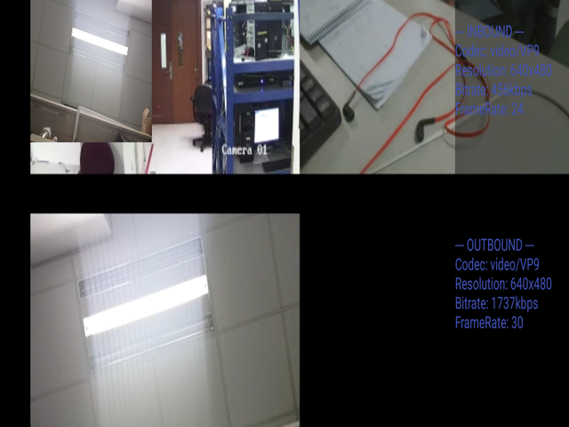

# Introduction

This document provides the guide to configurate owt client publish/subscribe codec.

## System Requirements

- Ubuntu 18.04
- owt-server v4.3.x
- owt-client-android v4.3

## OWT Client Android

### Configurate codec in Android conference sample
-	Click "SETTINGS" button
    - Choose "vp9" in "Publish Video Codec"
-	Click "CONNECT" button
-	Click "PUBLISH" button
-	Click "SUBSCRIBE" button
    - Choose stream in "Remote Stream List"
    - Choose "vp9" in "VideoCodec List"



### Android conference sample code

```java
  //Publish vp9 stream
  VideoEncodingParameters vp9 = new VideoEncodingParameters(VP9);
  PublishOptions options = PublishOptions.builder().addVideoParameter(vp9).build();
  conferenceClient.publish(localStream, options, callback);

  //Subscribe vp9 stream
  VideoSubscriptionConstraints videoOption = videoOptionBuilder.addCodec(new VideoCodecParameters(VP9)).build();
  SubscribeOptions options = SubscribeOptions.builder(true, true)
                                             .setAudioOption(audioOption)
                                             .setVideoOption(videoOption)
                                             .build()
  conferenceClient.subscribe(remoteStream, options, callback)
```